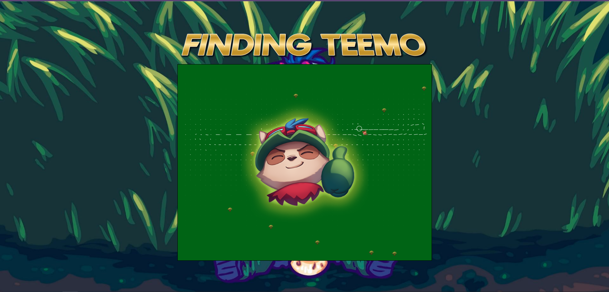
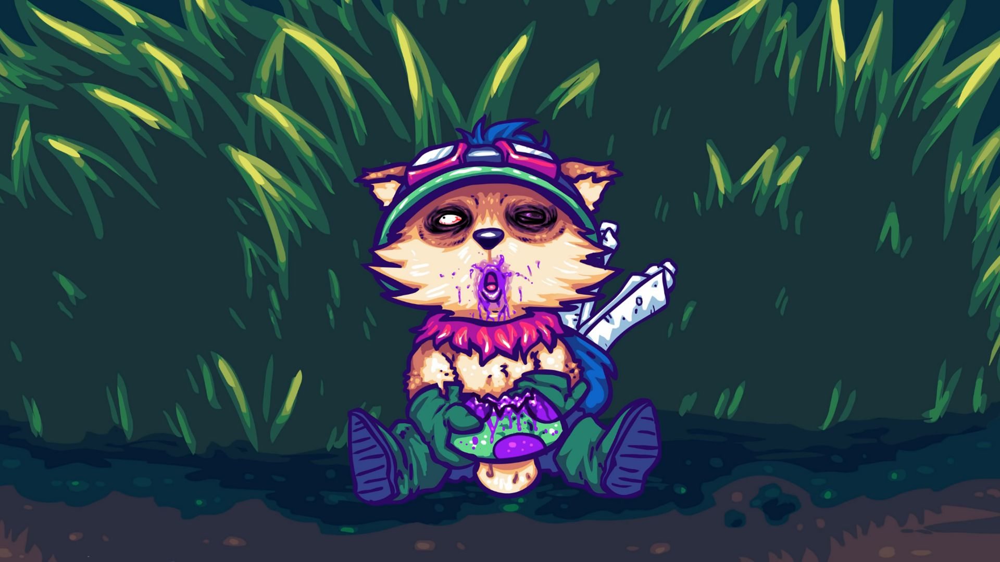

    
    <h2 align="center">Finding Teemo</h2>
    
A marco-polo-style game where you search through a field of tall grass with your mouse cursor to find Teemo while avoiding landing on mushrooms!

    

### About

Teemo is a League of Legends character who plants his hidden mushrooms around for enemies to unknowingly walk over and take damage. When Teemo stands in tall grass, he becomes invisible to the opponent. This game is a play on word from 'Finding Nemo' and puts together the original game's characteristics of Teemo!

This was coded entirely in VanillaJS in an effort to showcase the mathematical possibilities of the <code>canvas</code> tag in HTML.

### Credits

- Character concept: [Teemo - League of Legends](https://leagueoflegends.fandom.com/wiki/Teemo/LoL)
- Background image: Source Unknown

